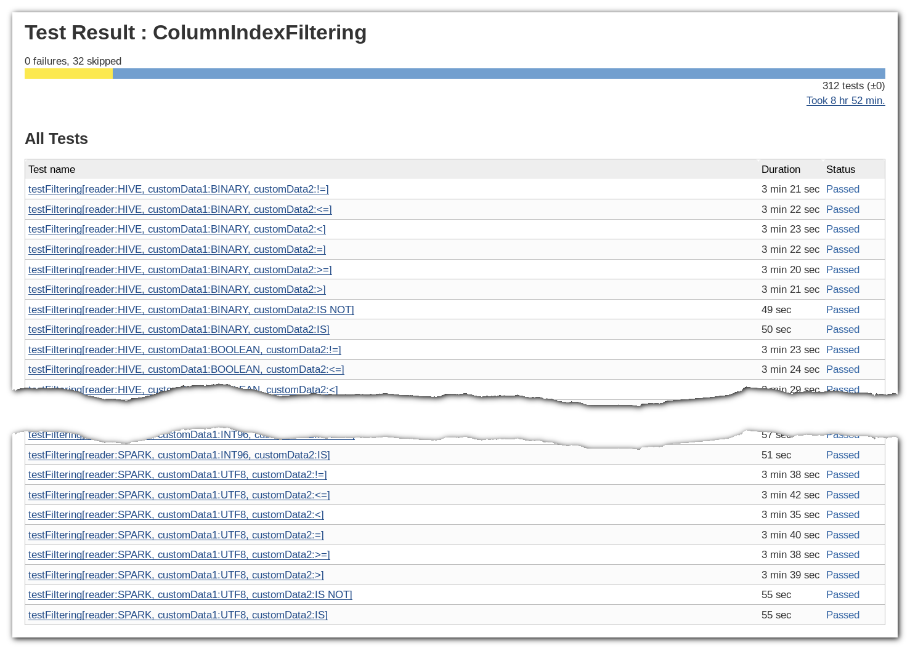
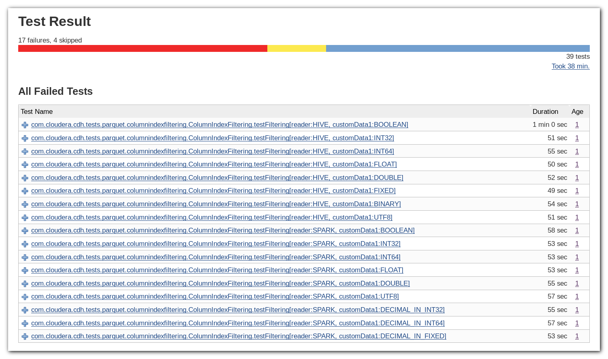

# Introduction

This repo contains excerpts from the data interoperability test suite
corresponding to [this test
plan](https://docs.google.com/document/d/1mHYQGXE4oM1zgg83MMc4ho1gmoJMeZcq9MWG99WgL3A/edit)
for column indexes.

The code depends on a testing framework that can not be made public as it
depends on proprietary ways of bringing up and managing clusters. As such, this
repository can not be compiled nor executed on its own and is only provided for
review purposes.

# Test results

The test have been executed using Hive, Spark and Impala readers. All tests are
passing (skipped tests are the result of non-supported data types in certain
components):

The exact meaning of these results depends on the component used for reading:

- Impala does not support column index filtering yet, therefore those results
  only confirm that files written by parquet-mr 1.11.0 can be read back by old
  readers.

- Java readers, on the other hand, automatically take advantage of column
  indexes without any code modification, provided that they correctly push down
  predicates to parquet-mr. The results of Spark and Hive tests therefore
  confirm the correctness of the column index writing and filtering.

# Fault injection

The effectiveness of the test itself has been checked using fault injection. For
this, the parquet-mr code has been modified to generate Parquet files with
intentionally corrupted indexes. In particular, the following two changes were
tested independently:

- The calculation of min/max values were modified so that both of them were set
  to the same value (the min value of the page).

- The logic recognizing the boundary order was modified so that it returned
  DESCENDING for ascending values and ASCENDING for descending or non-sorted
  values.

As expected, both of these changes resulted in test failures when using Spark or
Hive (this test run has less test cases in total because it was restricted to
the equality relation):

